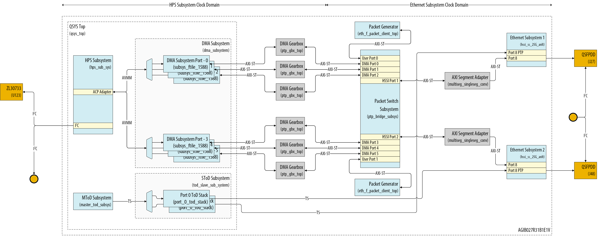

# Agilex&trade; 7 Precision Time Protocol System Example Design

## Description

The Agilex&trade; 7 Precision Time Protocol System Example Design includes two Ethernet ports with built-in 2-step hardware PTP timestamping capabilities. The integrated Agilex&trade; 7 Hard Processor System (HPS) operates a PTP software stack that complements the hardware-based timestamping functionality.

The System Example Design (SED) provides the necessary drivers and user applications to support the Linux Network stack, the Linux PTP stack, and network Quality of Service (QoS) through the Linux kernel Traffic Control (TC) system.

This System Example Design supports multiple Ethernet link data rates along with ANLT(Auto-Negotiation and Link Training) and DR(Dynamic Reconfiguration) feature.

1. 10GbE.
2. 25GbE.
3. 50GbE.
4. 100GbE.

Following are the design configurations.

|SL No| Design configuration                        | _Rate_   | _Feature_         |
|-----|---------------------------------------------|----------|:-----------------:|
|1.   |2-port 10GbE with PTP1588                    | 10GbE    | PTP1588           |
|2.   |2-port 10GbE with PTP1588 & ANLT             | 10GbE    | PTP1588+ANLT      |
|3.   |2-port 25GbE with PTP1588                    | 25GbE    | PTP1588           |
|4.   |2-port 25GbE with PTP1588 & ANLT             | 25GbE    | PTP1588+ANLT      |
|5.   |2-port 50GbE with PTP1588                    | 50GbE    | PTP1588           |
|6.   |2-port 50GbE with PTP1588 & ANLT             | 50GbE    | PTP1588+ANLT      |
|7.   |2-port 100GbE with PTP1588                   | 100GbE   | PTP1588           |
|8.   |2-port 100GbE with PTP1588 & ANLT            | 100GbE   | PTP1588+ANLT      |
|9.   |2-port 10GbE/25GbE-DR with PTP1588           | 10/25GbE | PTP1588+DR        |

The system's primary components include:

- Golden Hardware Reference Design (GHRD)
- Reference HPS software including:
  - Arm Trusted Firmware
  - U-Boot
  - Linux Kernel
  - Linux Drivers
  - User Space Applications

The block diagram below illustrates the architecture for a 25G design. This architecture is also applicable to other data rates (10GbE, 50GbE, and 100GbE); the only notable change is that the Ethernet subsystem will be replaced with the corresponding IP modules for each data rate.



## Repository Structure

Directory Structure Used in This Example Design:

``` bash
|--- agi027fd-si-devkit
  |   |--- src
  |   |   |--- hw
  |   |   |--- sw

```

## Project Details

- **Family**: Agilex&trade; 7 I-Series
- **Quartus Version**: 26.1
- **Development Kit**: Agilex&trade 7; I-Series Transceiver-SoC Development Kit (4x F-Tile) ([DK-SI-AGI027FD](https://www.altera.com/products/devkit/po-3248/agilex-7-fpga-i-series-transceiver-soc-development-kit-4x-f-tile))
- **Device Part**: AGIB027R31B1E1V
- **Documentation**: [Agilex&trade; 7Precision Time Protocol System Example Design](https://altera-fpga.github.io/rel-26.1/embedded-designs/agilex-7/i-series/ptp/agx7i-ptp-anlt/agx7i-ptp-anlt/)

## Getting Started

Building the design is easy with the scripts provided in the repo. Clone the repository to get the source files

``` bash
git clone https://github.com/altera-fpga/agilex7-ed-ptp.git
cd agilex7-ed-ptp
git checkout <tag>
```

Follow the below procedure to build the HW and the Software artifacts.

- [Building the hardware](./agi027fd-si-devkit/src/hw)
- [Building the software](./agi027fd-si-devkit/src/sw)
